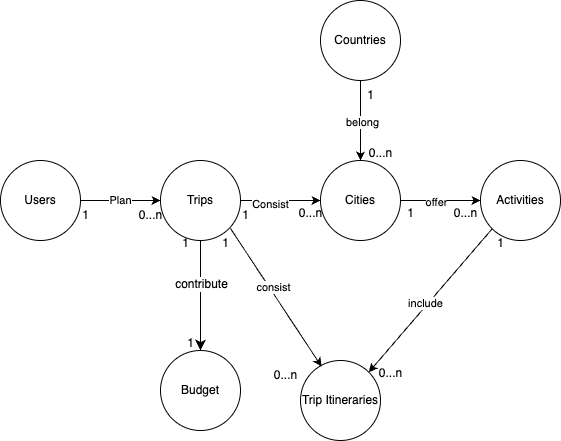

# Design Document - "TRIP PLANNER DATABASE"

By Choti

## Scope

<!-- In this section you should answer the following questions:

<!-- - What is the purpose of your database? -->

The purpose of the trip planner database is to assist users in planning and organizing their vacation activities. It aims to provide users with following:

- information about their destination
- activities available in destinations based on their preferences
- generate and manage trip itineraries
- estimate budgets for their trips

<!-- - Which people, places, things, etc. are you including in the scope of your database? -->

Included in the Scope of the Database:

- Cities: Information about various cities, including attractions, languages, etc.
- Activities: Different activities available in each city, categorized by type (sightseeing, dining, adventure, etc.).
- Users: Profiles of users, storing preferences (activity types, budget), past trips
- Trip Itineraries: specifying activities planned, dates, and budget estimates.
- Budget: Estimated costs associated with each trip.

Outside the Scope of the Database:

- availability and pricing of accommodations and flights
- availability and pricing of tickets to attractions
- details related to visas

## Functional Requirements

<!-- In this section you should answer the following questions: -->

<!-- - What should a user be able to do with your database? -->

This database will support:

- Create, read, update, and delete user profiles.
- Create, read, update, and delete cities and activities
- Search and filter activities for trip planning
- Create, edit, and delete trip itineraries
- Estimated budget planning

<!-- - What's beyond the scope of what a user should be able to do with your database? -->

The system will not support:

- Financial transactions such as payments for bookings

### Entities and Relationships

<!-- In this section you should include your entity relationship diagram and describe the relationships between the entities in your database. -->

The below entity relationship diagram describes the relationships among the entities in the database.

- Users: A user is capable of planning 0 to many trips. This means a user may have yet to plan any trips (0 trips), or they may have planned multiple trips.
- Trips: Each trip can consist of 1 to many cities. A city within a trip can have 0 to many activities. This means a user may have no plans for activities in a particular city (0 activities), or they may have planned multiple activities in that city.
- Cities: A city can have 0 to many activities available. This means there could be no activities listed for a city (0 activities), or there could be multiple activities listed.
- Activities: Each activity belongs to a specific city. An activity cannot exist without being associated with a city.
- Countries: Each country can have 0 to many cities. This means there could be no cities listed for a country (0 cities), or there could be multiple cities listed.
- Trip Itineraries: Each trip itinerary entry belongs to a specific trip and includes a planned date and an associated activity. This ensures that activities are scheduled within the trip's duration.
- Budget: Each activity has an associated cost, which contributes to the total estimated cost for the trip plan created by the user.

## Representation

Entities are captured in MySQL tables with the following schema.

### Tables

<!-- In this section you should answer the following questions:

- Which entities will you choose to represent in your database?
- What attributes will those entities have?
- Why did you choose the types you did?
- Why did you choose the constraints you did? -->

The database includes the following tables:

#### Users

The `users` table includes:

- `id`, which specifies the unique ID for the user as an `INTEGER`. This column thus has the `PRIMARY KEY` constraint applied.
- `first_name`, which specifies the user's first name as `VARCHAR(255)`
- `last_name`, which specifies the user's last name as `VARCHAR(255)`.
- `email`, which specifies the user's email address. `VARCHAR(255)` is used and a `UNIQUE` constraint ensures no two users have the same email.
- `country_of_residence`, which specifies the user's country of residence as `INTEGER`. This column thus has the `FOREIGN KEY` constraint applied, referencing the id column in the `countries` table to ensure data integrity.
- `preferences`, which specifies the user's activity preferences as `TEXT`. This field can store a comma-separated list of preferences.
- `created_at`, which specifies when the user registered. The default value for the `created_at` attribute is the current timestamp, as denoted by `DEFAULT (CURRENT_TIMESTAMP)` statement.

#### Trips

The `trips` table includes:

- `id`, which specifies the unique ID for the trip as an `INTEGER`. This column thus has the `PRIMARY KEY` constraint applied.
- `user_id`, which is the ID of the user who created the trip as an `INTEGER`. This column thus has the `FOREIGN KEY` constraint applied, referencing the `id` column in the users table to ensure data integrity.
- `name`, which specifies the name of the trip as `VARCHAR(255)`.
- `start_date`, which specifies the start date of the trip as `DATE`.
- `end_date`, which specifies the end date of the trip as `DATE`.
- `budget_estimate`, which specifies the estimated budget for the trip as a `DECIMAL(10, 2)`.

All columns in the table are required and hence should have the `NOT NULL` constraint applied.

#### Countries

The `countries` table includes:

- `id`, which specifies the unique ID for the country as an `INTEGER`. This column thus has the `PRIMARY KEY` constraint applied.
- `name`, which specifies the name of the country as `VARCHAR(255)`.
- `languages`, which specifies the languages spoken in the country as `VARCHAR(255)`.
- `currency`, which specifies the currency used in the country as `VARCHAR(255)`.

All columns in the table are required and hence should have the `NOT NULL` constraint applied.

#### Cities

The `cities` table includes:

- `id`, which specifies the unique ID for the city as an `INTEGER`. This column thus has the `PRIMARY KEY` constraint applied.
- `name`, which specifies the name of the city as `VARCHAR(255)`. -`country_id`, which specifies the ID of the country the city belongs to as an `INTEGER`. This column thus has the `FOREIGN KEY` constraint applied, referencing the id column in the `countries` table to ensure data integrity.

All columns in the table are required and hence should have the `NOT NULL` constraint applied.

#### Activities

The `activities` table includes:

- `id`, which specifies the unique ID for the activity as an `INTEGER`. This column thus has the `PRIMARY KEY` constraint applied.
- `city_id`, which is the ID of the city where the activity is located as an `INTEGER`. This column thus has the `FOREIGN KEY` constraint applied, referencing the id column in the cities table to ensure data integrity.
- `name`, which specifies the name of the activity as `VARCHAR(255)`
- `description`, which provides a description of the activity as `TEXT`
- `type`, which specifies the type of activity (sightseeing, dining, adventure, etc.) as `VARCHAR(255)`
- `cost`, which specifies the cost of the activity as a `DECIMAL(10, 2)`

All columns in the table are required and hence should have the `NOT NULL` constraint applied.

#### Trip Itineraries

The `trip_itineraries` table includes:

- `id`, which specifies the unique ID for the trip itinerary entry as an `INTEGER`. This column thus has the PRIMARY KEY constraint applied.
- `trip_id`, which is the ID of the trip as an `INTEGER`. This column thus has the `FOREIGN KEY` constraint applied, referencing the id column in the `trips` table to ensure data integrity.
- `activity_id`, which is the ID of the activity as an `INTEGER`. This column thus has the `FOREIGN KEY` constraint applied, referencing the id column in the `activities` table to ensure data integrity.
- `planned_date`, which specifies the date the activity is planned as `DATE`.

All columns in the table are required and hence should have the `NOT NULL` constraint applied. The `planned_date`column has an additional constraint to check if it falls within the trip's `start_date` and `end_date`.

#### Budget

The `budget` table includes:

- `id`, which specifies the unique ID for the budget entry as an `INTEGER`. This column thus has the `PRIMARY KEY` constraint applied.
- `trip_id`, which is the ID of the trip as an `INTEGER`. This column thus has the `FOREIGN KEY` constraint applied, referencing the id column in the trips table to ensure data integrity.
- `estimated_cost`, which specifies the estimated cost of the trip as a `DECIMAL(10, 2)`.

## Optimizations

In this section you should answer the following questions:

- Which optimizations (e.g., indexes, views) did you create? Why?
  - Strive to have at least one index and one view

## Limitations

In this section you should answer the following questions:

- What are the limitations of your design?
- What might your database not be able to represent very well?
